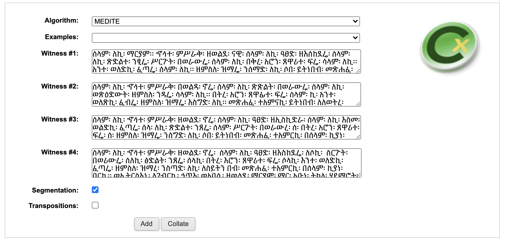

# testing a prototype edition workflow

day 1

Started at 12:45.

## 1. search for texts of which we have images and a manuscript description
limited to ES, due to likelyhood of description and images.
````xquery
xquery version "3.1";
declare namespace t = "http://www.tei-c.org/ns/1.0";
let $col :=collection('/users/hlz-ad/Documents/GitHub/Manuscripts/ES/?select=*.xml')
for $content in $col//t:msItem[count(t:locus) = 1][t:locus[@from][@to]][ancestor::t:TEI[descendant::t:idno[@n][@facs]]]/t:title[@ref]
group by $title := $content/@ref
let $count := count($content)
order by $count descending
return
if(($count eq 5) and not(contains($title, '#'))) then
(<thistext>{$title}<iscontained>{$count}</iscontained>{for $c in $content return <ms>{string($c/ancestor::t:TEI/@xml:id)}{$c/parent::t:msItem/t:locus}</ms>}</thistext>)
else ()

````

Select a short text which is not related to many others


````xml
<thistext>LIT4714Salamlaki<iscontained>5</iscontained>
   <ms>ESqs014<locus xmlns="http://www.tei-c.org/ns/1.0" from="7vc" to="8ra">7vc-8ra</locus>
   </ms>
   <ms>ESamm007<locus xmlns="http://www.tei-c.org/ns/1.0" from="5va" to="5vb"/>
   </ms>
   <ms>ESamq014<locus xmlns="http://www.tei-c.org/ns/1.0" from="5va" to="5vb"/>
   </ms>
   <ms>ESmr001<locus xmlns="http://www.tei-c.org/ns/1.0" from="93rb" to="94rb"/>
   </ms>
   <ms>ESum014<locus xmlns="http://www.tei-c.org/ns/1.0" from="9ra" to="9rb"/>
   </ms>
</thistext>
````

Check the database https://betamasaheft.eu/works/LIT4714Salamlaki/main

Salām laki ḫoḫǝta mǝśrāq

There are 13 manuscripts in total, some of them contain this text in the main and some in the secondary strata.

## 2. retrieve relevant images and transcribe with Transkribus

https://betamasaheft.eu/manuscripts/ESum014/viewer
https://betamasaheft.eu/manuscripts/ESmr001/viewer
https://betamasaheft.eu/manuscripts/ESqs014/viewer
https://betamasaheft.eu/manuscripts/ESamm007/viewer
https://betamasaheft.eu/manuscripts/ESamq014/viewer

navigate to correct relevant image from manifest (not possible without knowledge of response...)

https://betamasaheft.eu/iiif/UM/014/UM-014_009.tif/full/full/0/default.jpg
https://betamasaheft.eu/iiif/MR/001/MR-001_093.tif/full/full/0/default.jpg
https://betamasaheft.eu/iiif/QS/014/QS-014_008.tif/full/full/0/default.jpg
https://betamasaheft.eu/iiif/AMM/007/AMM-007_006.tif/full/full/0/default.jpg
https://betamasaheft.eu/iiif/AMQ/014/AMQ-014__006.tif/full/full/0/default.jpg

load images to transkribus and process

time check 13.30

run layout analysis
cleaned up layout analysis
run HTR

https://transkribus.eu/lite/collection/125718/doc/833390


time check 13.37

skip fix of text

exported to TEI locally

copied into Collatex demo https://collatex.net/demo/

ATTENTION! THE TEXT IS THE ENTIRE TEXT ON THE IMAGE!!

exported TEI app fragment

time check 13.47

REPEAT with CORRECTLY SELECTED TEXT


document witnesses in TEI file

````xml
<listWit>

					<witness xml:id="W1" corresp="https://betamasaheft/ESamm007"
							><idno>ESamm007</idno><locus xmlns="http://www.tei-c.org/ns/1.0"
							from="5va" to="5vb"/></witness>
					<witness xml:id="W2" corresp="https://betamasaheft/ESamq014"
							><idno>ESamq014</idno><locus xmlns="http://www.tei-c.org/ns/1.0"
							from="5va" to="5vb"/></witness>
					<witness xml:id="W3" corresp="https://betamasaheft/ESmr001"
							><idno>ESmr001</idno><locus xmlns="http://www.tei-c.org/ns/1.0"
							from="93rb" to="94rb"/></witness>
					<witness xml:id="W4" corresp="https://betamasaheft/ESqs014"
							><idno>ESqs014</idno><locus xmlns="http://www.tei-c.org/ns/1.0"
							from="7vc" to="8ra">7vc-8ra</locus></witness>
					<witness xml:id="W5" corresp="https://betamasaheft/ESum014"
							><idno>ESum014</idno><locus xmlns="http://www.tei-c.org/ns/1.0"
							from="9ra" to="9rb"/></witness>
				</listWit>
````


merge with TEI record in BM


asked Solomon for help 13.57

asked Getinet to check text of HTR result at 14.01

stop phase 1 of test


day 2.

time 8.05

With Solomon indication I start encoding the manuscript transcriptions and the prepare the work file which will have the edition.
Make branch editionTest on Manuscripts and works

add to atom the Manuscripts ES folder and Works LIT 4001-5000

opened manuscripts files and copied facsimiles from the transkribus export to manuscripts (except ESamq014 for which I had picked the wrong image). These are unlikely to change even after getinet has finished fixing the transcription.


for the collation only part of the transcription is necessary. Solomon helped me by identifying the correct place of beginning and end.

1.     https://betamasaheft.eu/iiif/UM/014/UM-014_009.tif/full/full/0/default.jpg
       Begins 9r, columns 1, line 13 and ends 9r, column 2, line 7
2.     https://betamasaheft.eu/iiif/MR/001/MR-001_093.tif/full/full/0/default.jpg
       Begins 83r, column 2, line 1 and ends 83r, column 2, line 13
3.     https://betamasaheft.eu/iiif/QS/014/QS-014_008.tif/full/full/0/default.jpg
       Begins 8v column 3, line 12 and ends 9r column 1, line 6
4.     https://betamasaheft.eu/iiif/AMM/007/AMM-007_006.tif/full/full/0/default.jpg
       Begins with verso column 1 (I cannot read the number of the folio in this  
       manuscript), line 9 and ends verso column 2, line 9.
5.     https://betamasaheft.eu/iiif/AMQ/014/AMQ-014__006.tif/full/full/0/default.jpg
       This text is not available in this folio.

In the manuscripts where the identification is correct I can start encoding the structure necessary for the text.
This could have been supported by using the transkribus2BM.xsl, which is however here not necessary, because the text is very short.

at this step, that is still without the corrections of the transcription, the text in the manuscript will look like this.


````xml
<div type="edition" xml:lang="gez">
<div type="textpart" subtype="folio" n="9">
  <div type="textpart" corresp="#p1_i1.2">
<ab><pb n="9r" facs='#facs_5'/>
<cb n="a" facs='#facs_5_r3'/>
<lb facs='#facs_5_r3l13' n='13'/>ኖኂተ፡ ሞሥ
<lb facs='#facs_5_r3l14' n='14'/>እእ
<lb facs='#facs_5_r3l15' n='15'/>ራቅ፡ ዘወልደ፡ ኖሬ፡ ሰላም
<lb facs='#facs_5_r3l16' n='16'/>ለኪ፡ ዓፀድ፡ ዘእስከደረ፡
<lb facs='#facs_5_r3l17' n='17'/>ለም፡ ስርጉት፡ በወሪ
<lb facs='#facs_5_r3l18' n='18'/>ውሬ፡ ሰለኪ፡ ሰድልት
<lb facs='#facs_5_r3l19' n='19'/>ንጸሬ፡ ሰላኪ፡ በትረ፡ እ
<lb facs='#facs_5_r3l20' n='20'/>ሮን፡ ጸዋሪተ፡ ፍሬ፡ ሶብ
<lb facs='#facs_5_r3l21' n='21'/>፡ እንተ፡ ወለድኪ፡ ፈ
<lb facs='#facs_5_r3l22' n='22'/>ብሬ፡ ዘምስለ፡ ዝማረ፡
<lb facs='#facs_5_r3l23' n='23'/>ንወድለኪ፡ ለበይት
<lb facs='#facs_5_r3l24' n='24'/>በብ፡ መጽሐፈ፡ ተአም
<lb facs='#facs_5_r3l25' n='25'/>ርኪ፡ በሰላም፡ ኪያነ፡ ባ
<cb n="b" facs='#facs_5_r4'/>
<lb facs='#facs_5_r4l1' n='1'/>ርኪ። ወኢትርስእኒ፡ ለ
<lb facs='#facs_5_r4l2' n='2'/>ገብርኪ፡ ኃጥእ፡ ወአባሴ
<lb facs='#facs_5_r4l3' n='3'/>ተ፡ወልደ፡ ማርያም
<lb facs='#facs_5_r4l4' n='4'/>ማር፡ አቡነ፡ ትክለ፡ ሃይወ
<lb facs='#facs_5_r4l5' n='5'/>ሮት፡ ወልደሙ፡ ለአቡን
<lb facs='#facs_5_r4l6' n='6'/>ዘገብርኤል፡ በዓለመ፡ ዘ
<lb facs='#facs_5_r4l7' n='7'/>ለም፡ አሜን፡ ወአሜን፡
</ab></div>
</div>
</div>
````

Here we still have to add the encoding of, e.g. rubrication, corrections, normalizations, etc. https://betamasaheft.eu/Guidelines/?id=text-encoding
The correction of the text can be done in transkribus before exporting or in the TEI of the manuscript.
If done in transkribus only visible text should be entered. Markup will be added in the TEI.
If correction and markup are done in the TEI directly that happens after export, as in this example.
I copied to the files only the relevant part of the text as identified by Solomon.

once correction and encoding took place the text in the mss will look like thistext

````xml
<div type="edition" xml:lang="gez">
<div type="textpart" subtype="folio" n="93">
  <ab>
    <pb facs='#facs_1' xml:id='AMM-007_006.jpeg'
      n='5v'/><cb facs='#facs_1_r1'
     n="a"/><lb facs='#facs_1_r1l9'
      n='9'/>ንፈስ።</ab><div type="textpart" corresp="#ms_i1.1.1"><ab
      >ሰላም፡ ለኪ፡ ማርያ<lb facs='#facs_1_r1l10'
    n='10'/>ም። ኆኅተ፡ ምሥራቅ፡ ዘወ<lb facs='#facs_1_r1l11'
    n='11'/>ልደ፡ ናዊ፡ ሰላም፡ ለኪ፡ ዓፀድ፡<lb facs='#facs_1_r1l12'
    n='12'/>ዘእሰከደሬ፡ ሰላም፡ ለኪ፡ ጽ<lb facs='#facs_1_r1l13'
    n='13'/>ድልተ፡ ንፂሬ፡ ሥርጉት፡ በወ<lb facs='#facs_1_r1l14'
    n='14'/>ራውሬ፡ ሰላም፡ ለኪ፡ በቅ<lb facs='#facs_1_r1l15'
    n='15'/>ረ፡ አሮን፡ ጸዋሪተ፡ ፍሬ፡ ሳላ<lb facs='#facs_1_r1l16'
    n='16'/>ም፡ ለኪ። አንተ፡ ወለድኪ፡ ፈ<lb facs='#facs_1_r1l17'
    n='17'/>ጣሬ፡ ሰላም፡ ለኪ። ዘምስለ፡<lb facs='#facs_1_r1l18'
    n='18'/>ዝማሬ፡ ንሰ<add place="top">ማ</add>ድ፡ ለኪ፡ ሶበ፡ ይ<lb facs='#facs_1_r1l19'
    n='19'/>ትነበብ፡ መጽሐፈ፡ ተአም<lb facs='#facs_1_r1l20'
    n='20'/>ርኪ። በሰላም፡ ኪያነ፡ በር<cb facs='#facs_1_r2'
    n="b"/><lb facs='#facs_1_r2l1'
    n='1'/>ኪ። ወላዲተ፡ አምላክ፡ ማ<lb facs='#facs_1_r2l2'
    n='2'/>ርያም፡ እንበለ፡ ዕብሳብ፡ ወ<lb facs='#facs_1_r2l3'
    n='3'/>ሩካቤ፡ በይነ፡ ዘዓቀሂ፡ ብኩ<lb facs='#facs_1_r2l4'
    n='4'/>ለኪ፡ ንስቲተ፡ ቃለ፡ ይባቤ፡<lb facs='#facs_1_r2l5'
    n='5'/>ፈትዊ፡ እሙ፡ በረከተ፡ አፉ<lb facs='#facs_1_r2l6'
    n='6'/>ኪ፡ ሙሐዘ፡ ከርቤ። ለነዳይ፡<lb facs='#facs_1_r2l7'
    n='7'/>ብእሲ፡ ወለዘረከበ፡ ምንደ<lb facs='#facs_1_r2l8'
    n='8'/>ቤ፡ ኅብስተከ፡ ፈትት፡ ኢሳይ<lb facs='#facs_1_r2l9'
    n='9'/>ያስ፡ ይቤ።
   </ab>
 </div>
 </div>
 </div>
````

The important part here is that text has been checked line by line against the image (here there are certainly errors, because I am analphabet) an transcription phenomena have been encoded, for example the letter added at the top  in line 18.
Note that spaces before pb, cb and lb have been removed. This text is now ready for Collatex.

The text in ESamq014 could not be located on the images, so it is not included in the collation and has been removed from the list of witnesses.




corrected texts in transkribus and run collation, run with the medite algorithm. The following is the resulting XML, which I took for correct and pasted into the edition file.

````xml
<div type="edition" xml:lang="gez">
               <div type="textpart" subtype="incipit"  xml:id="Incipit">

                   <ab> ሰላም፡ ለኪ፡<app>
                           <rdg wit="W1">ማርያም።</rdg>
                           <rdg wit="W2 W3 W4"/>
                       </app>ኆኅተ፡ ምሥራቅ፡</ab></div>
               <div type="textpart"><ab>
               <app>
                           <rdg wit="W3 W4 W1">ዘወልደ፡</rdg>
                           <rdg wit="W2">በወልዳ፡</rdg>
                       </app><app>
                           <rdg wit="W1">ናዊ፡</rdg>
                           <rdg wit="W2 W3 W4">ኖሬ፡</rdg>
                       </app>ሰላም፡ ለኪ፡<app>
                           <rdg wit="W3 W4 W1">ዓፀድ፡</rdg>
                           <rdg wit="W2">ጽጽልት፡</rdg>
                       </app><app>
                           <rdg wit="W1">ዘእሰከደሬ፡</rdg>
                           <rdg wit="W2"/>
                           <rdg wit="W3">ዘኢስኪድራ፡</rdg>
                           <rdg wit="W4">ዘእስከደሬ፡ ለሶኪ፡ ስርጉት፡ በወሪውሬ፡ ሰለኪ፡ ፅድልት፡</rdg>
                       </app><app>
                           <rdg wit="W2 W4 W1"/>
                           <rdg wit="W3">ሰላም፡ ለኪ፡</rdg>
                       </app><app>
                           <rdg wit="W2 W4 W1"/>
                           <rdg wit="W3">እስመ፡ ወልድኪ፡</rdg>
                       </app><app>
                           <rdg wit="W2 W4 W1"/>
                           <rdg wit="W3">ፈጣሬ፡</rdg>
                       </app><app>
                           <rdg wit="W2 W4 W1"/>
                           <rdg wit="W3">ሰላ፡</rdg>
                       </app><app>
                           <rdg wit="W2 W4 W1"/>
                           <rdg wit="W3">ለኪ፡ ጽድልተ፡</rdg>
                       </app><app>
                           <rdg wit="W2 W1"/>
                           <rdg wit="W3 W4">ንጸሬ፡</rdg>
                       </app><app>
                           <rdg wit="W3 W1">ሰላም፡</rdg>
                           <rdg wit="W2"/>
                           <rdg wit="W4">ሰላኪ፡</rdg>
                       </app><app>
                           <rdg wit="W1">ለኪ፡ ጽድልተ፡</rdg>
                           <rdg wit="W2 W3 W4"/>
                       </app><app>
                           <rdg wit="W1">ንፂሬ፡</rdg>
                           <rdg wit="W2 W3 W4"/>
                       </app><app>
                           <rdg wit="W3 W1">ሥርጉት፡</rdg>
                           <rdg wit="W2 W4"/>
                       </app><app>
                           <rdg wit="W2 W1">በወራውሬ፡</rdg>
                           <rdg wit="W3">በወራውረ፡ ሰ፡</rdg>
                           <rdg wit="W4"/>
                       </app><app>
                           <rdg wit="W2 W1">ሰላም፡</rdg>
                           <rdg wit="W3 W4"/>
                       </app><app>
                           <rdg wit="W2 W1">ለኪ፡</rdg>
                           <rdg wit="W3 W4"/>
                       </app><app>
                           <rdg wit="W1">በቅረ፡</rdg>
                           <rdg wit="W2">ወጽዕድውት፡ ዘምስለ፡ ንዳሬ፡</rdg>
                           <rdg wit="W3 W4"/>
                       </app><app>
                           <rdg wit="W3 W4 W1"/>
                           <rdg wit="W2">ሳላም፡ ለኪ።</rdg>
                       </app><app>
                           <rdg wit="W1"/>
                           <rdg wit="W2 W3 W4">በትረ፡</rdg>
                       </app><app>
                           <rdg wit="W2 W3 W1">አሮን፡</rdg>
                           <rdg wit="W4">እሮን፡</rdg>
                       </app><app>
                           <rdg wit="W4 W1">ጸዋሪተ፡</rdg>
                           <rdg wit="W2">ጸዋፊተ፡</rdg>
                           <rdg wit="W3">ጸዋሪተ፡ፍሬ፡ ሰ፡</rdg>
                       </app><app>
                           <rdg wit="W2 W4 W1">ፍሬ፡</rdg>
                           <rdg wit="W3"/>
                       </app><app>
                           <rdg wit="W1">ሳላም፡ ለኪ።</rdg>
                           <rdg wit="W2 W3 W4"/>
                       </app><app>
                           <rdg wit="W2 W3 W1"/>
                           <rdg wit="W4">ሶላኪ፡ እንተ፡</rdg>
                       </app><app>
                           <rdg wit="W3 W4 W1"/>
                           <rdg wit="W2">ሰላም፡</rdg>
                       </app><app>
                           <rdg wit="W3 W4 W1"/>
                           <rdg wit="W2">ኪ፡</rdg>
                       </app><app>
                           <rdg wit="W2 W1">አንተ፡</rdg>
                           <rdg wit="W3 W4"/>
                       </app><app>
                           <rdg wit="W4 W1">ወለድኪ፡</rdg>
                           <rdg wit="W2">ወለጽኪ፡ ፈብሬ፡</rdg>
                           <rdg wit="W3"/>
                       </app><app>
                           <rdg wit="W4 W1">ፈጣሬ፡</rdg>
                           <rdg wit="W2 W3"/>
                       </app><app>
                           <rdg wit="W1">ሰላም፡</rdg>
                           <rdg wit="W2 W3 W4"/>
                       </app><app>
                           <rdg wit="W1"/>
                           <rdg wit="W2 W3 W4">ዘምስለ፡</rdg>
                       </app><app>
                           <rdg wit="W2 W3 W1"/>
                           <rdg wit="W4">ዝማረ፡ ንስጣድ፡</rdg>
                       </app><app>
                           <rdg wit="W4 W1"/>
                           <rdg wit="W2 W3">ዝማሬ፡</rdg>
                       </app><app>
                           <rdg wit="W2 W3 W1"/>
                           <rdg wit="W4">ለኪ፡</rdg>
                       </app><app>
                           <rdg wit="W4 W1"/>
                           <rdg wit="W2">እስግድ፡</rdg>
                           <rdg wit="W3">ንሰግድ፡</rdg>
                       </app><app>
                           <rdg wit="W2 W1">ለኪ።</rdg>
                           <rdg wit="W3"/>
                           <rdg wit="W4">ለስይትን በብ፡</rdg>
                       </app><app>
                           <rdg wit="W1">ዘምስለ፡ ዝማሬ፡</rdg>
                           <rdg wit="W2 W3 W4"/>
                       </app><app>
                           <rdg wit="W3 W4 W1"/>
                           <rdg wit="W2">መጽሐፈ፡</rdg>
                       </app><app>
                           <rdg wit="W1">ንሰማድ፡</rdg>
                           <rdg wit="W2">ተአምናኪ፡</rdg>
                           <rdg wit="W3 W4"/>
                       </app><app>
                           <rdg wit="W3 W1">ለኪ፡ ሶበ፡</rdg>
                           <rdg wit="W2 W4"/>
                       </app><app>
                           <rdg wit="W2 W3 W1">ይትነበብ፡</rdg>
                           <rdg wit="W4"/>
                       </app><app>
                           <rdg wit="W3 W4 W1">መጽሐፈ፡</rdg>
                           <rdg wit="W2"/>
                       </app><app>
                           <rdg wit="W3 W4 W1"/>
                           <rdg wit="W2">ለለወትረ፡</rdg>
                       </app><app>
                           <rdg wit="W1">ተአምርኪ።</rdg>
                           <rdg wit="W2"/>
                           <rdg wit="W3 W4">ተአምርኪ፡</rdg>
                       </app><app>
                           <rdg wit="W3 W4 W1">በሰላም፡</rdg>
                           <rdg wit="W2"/>
                       </app><app>
                           <rdg wit="W1"/>
                           <rdg wit="W2 W3 W4">ኪያነ፡</rdg>
                       </app><app>
                           <rdg wit="W1"/>
                           <rdg wit="W2">ባርኪ፡ ሰላመ፡ ባርኪ፡</rdg>
                           <rdg wit="W3 W4">ባርኪ።</rdg>
                       </app><app>
                           <rdg wit="W2 W1">ኪያነ፡</rdg>
                           <rdg wit="W3"/>
                           <rdg wit="W4">ወኢትርስእኒ፡ ለገብርኪ፡ ኃጥእ፡ ወአባሴ፡ ዘወልደ፡ ማርያሞ፡ ማር፡ አቡነ፡ ትክለ፡
                               ሃይማሮት፡ ወልደሙ፡ ለአቡን፡ ዘገብርኤል፡ ለዓለመ፡ ንለም፡ አሜን፡ ወአሜን፡</rdg>
                       </app><app>
                           <rdg wit="W1">በርኪ። ወላዲተ፡ አምላክ፡ ማርያም፡ እንበለ፡ ዕብሳብ፡ ወሩካቤ፡ በይነ፡ ዘዓቀሂ፡ ብኩለኪ፡
                               ንስቲተ፡ ቃለ፡ ይባቤ፡ ፈትዊ፡ እሙ፡ በረከተ፡ አፉኪ፡ ሙሐዘ፡ ከርቤ። ለነዳይ፡ ብእሲ፡ ወለዘረከበ፡
                               ምንደቤ፡ ኅብስተከ፡ ፈትት፡ ኢሳይያስ፡ ይቤ።</rdg>
                           <rdg wit="W2">ኅቡረ።</rdg>
                           <rdg wit="W3 W4"/>
                       </app>
                   </ab>
               </div>
           </div>
````


committed to branches.

time check 14.16

moved to Oxygen
branched local fork of MakePDF package
changed the settings and edited the driver file in preparation for output, removed extra files from package.

driver points to the files as they are in the local file system, which is on the editionTest branches for both Works and Repositories.

settings changed to article
added photos.

Tests:

- export edition as TEI-->docx within oxygen: result is very poor.

- integrate in PDF production
    - the objective is the edition, so, start from the Work file and fetch relevant sources from the DTS collection endpoint.
    - print introduction with integrated views from BM. see below
    - print all manuscript descriptions in shortened form (mersha) exclude those used in the edition.
    - print long descriptions for the four manuscripts used for the edition, selecting them from the list retrieved from DTS based on listWit. (dorothea)
    - text printed should have apparatus printed out from viewItem module xquery
    - use also those for indexes. (dorothea)


- integrate views from manuscripts containg the work:
    map, comparison
    https://betamasaheft.eu/compare?workid=LIT4714Salamlaki
    https://betamasaheft.eu/workmap?worksid=LIT4714Salamlaki

- integrate in BM branches and produce PDF from branch (DTS improved module + viewItem module expansion for apparata)
- export list of contributors to manuscript descriptions in the PDF output
